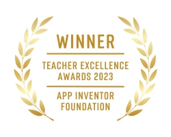
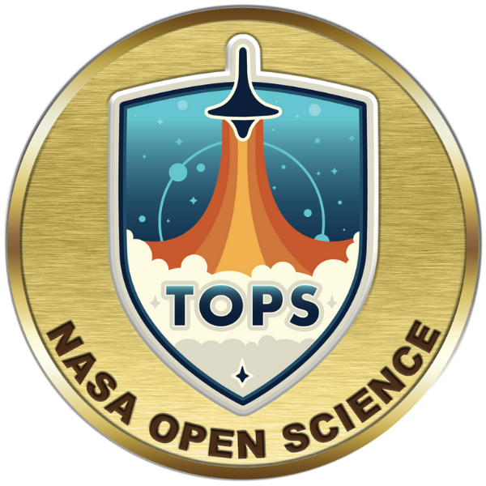

<table border="1" cellpadding="5" cellspacing="0" style="border-collapse: collapse; border: 1px solid black; width: 300px; margin-left: auto; margin-right: auto;">
  <tr>
    <td style="border: 1px solid black; padding: 5px; width: 100px;">
      
Welcome to my page

      
<a href="https://rmayormartins.github.io/" target="_blank">Ramon Mayor Martins</a>

    </td>
  </tr>
</table>

 <a href="about.html">About me</a> •
 <a href="current.html">Current Status</a> •
 <a href="publications.html">Publications & Patents</a> • 
 <a href="academic.html">Academic Profile</a> •
<a href="technicalprofile.html">Technical profile</a>  •
<a href="https://wiki.sj.ifsc.edu.br/index.php/Ramon_Mayor_Martins" target="_blank">Wikihome</a> •
<a href="http://lattes.cnpq.br/6289204315531991" target="_blank">Resume</a> •
 <a href="contributions.html">Contributions</a> • 
 <a href="tasklist.html">Task List</a>

Ramon Mayor Martins holds a Ph.D. in Computer Science from the [Universidade Federal de Santa Catarina](https://ufsc.br) (2024). He earned a Master's degree in Telecommunications from [Instituto Nacional de Telecomunicações](https://www.inatel.br) (2014). He holds postgraduate certificates in Systems Engineering, Computer Networks, and Telecommunications Systems, as well as a Professional MBA in Systems Analysis and Telecommunications. Additionally, he completed a Bachelor's degree in Electrical Engineering with an emphasis on Telematics / Telecommunications Engineering from the [Universidade do Sul de Santa Catarina](https://www.unisul.br) (2010). 

Since 2016, he has been a tenured associate professor in the area of Telecommunications at [Instituto Federal de Santa Catarina](https://www.ifsc.edu.br/), Campus São José.

<table>
  <tr>
    <td></td>
    <td><i>MIT App Inventor Foundation 2023 Teacher Excellence Award</i></td>
  </tr>
</table>
<table>
  <tr>
    <td></td>
    <td><i>NASA OpenScience Qualified</i></td>
  </tr>
</table>

  <code style="font-family: Consolas;">ramon.mayor at: ifsc.edu.br</code>

